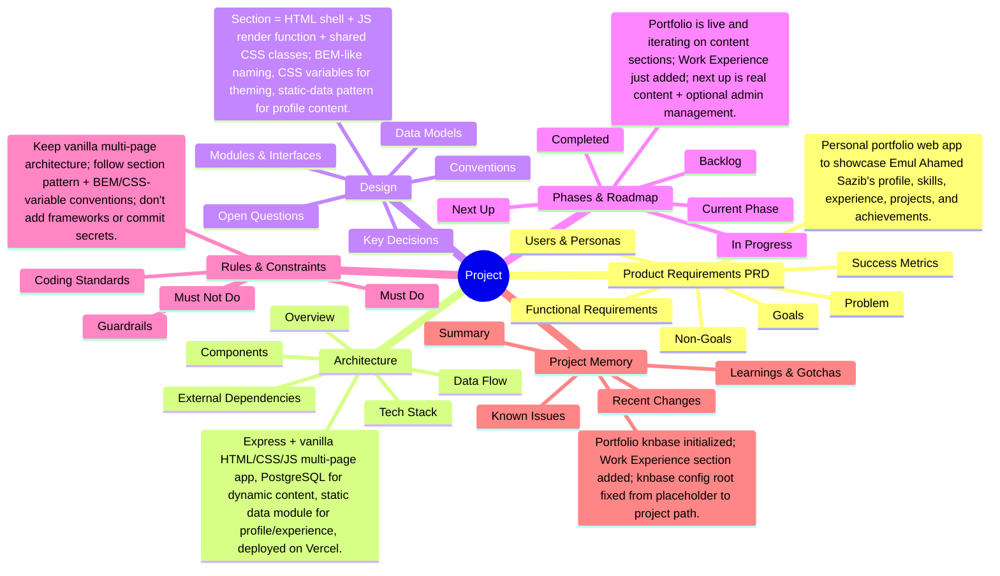

# Project Mind Map

<!-- Auto-generated by knbase. Do not edit by hand. -->

## Index

| File | State | Summary |
| --- | --- | --- |
| prd | ok | Personal portfolio web app to showcase Emul Ahamed Sazib's profile, skills, experience, projects, and achievements. |
| architecture | ok | Express + vanilla HTML/CSS/JS multi-page app, PostgreSQL for dynamic content, static data module for profile/experience, deployed on Vercel. |
| design | ok | Section = HTML shell + JS render function + shared CSS classes; BEM-like naming, CSS variables for theming, static-data pattern for profile content. |
| phase | ok | Portfolio is live and iterating on content sections; Work Experience just added; next up is real content + optional admin management. |
| rules | ok | Keep vanilla multi-page architecture; follow section pattern + BEM/CSS-variable conventions; don't add frameworks or commit secrets. |
| memory | ok | Portfolio knbase initialized; Work Experience section added; knbase config root fixed from placeholder to project path. |

_Updated: 2026-07-16T19:58:58.231Z_
